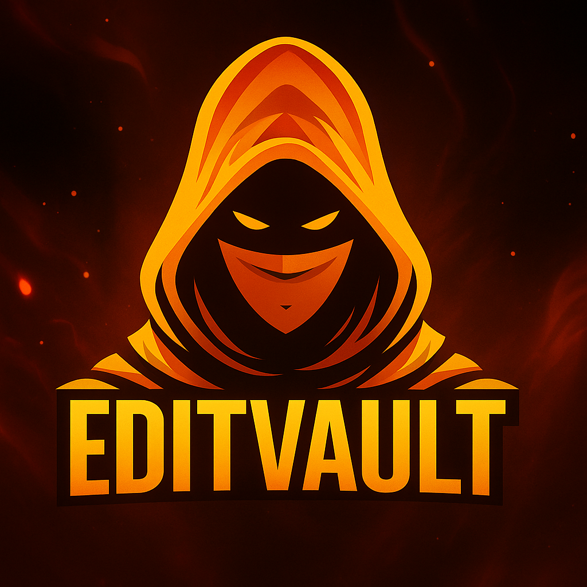
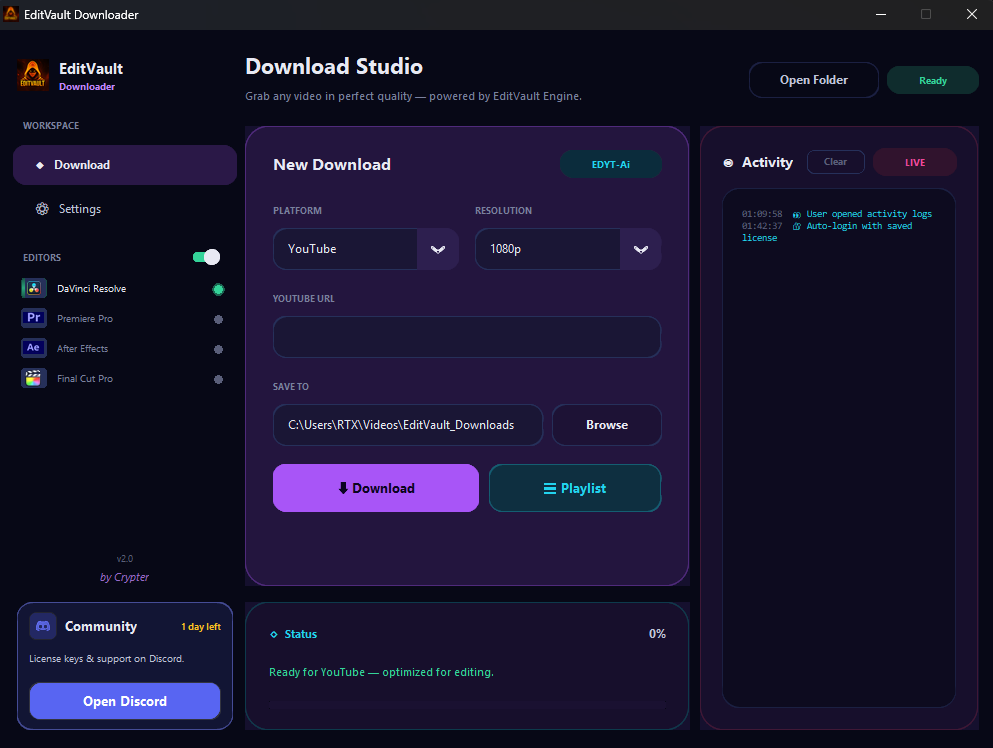
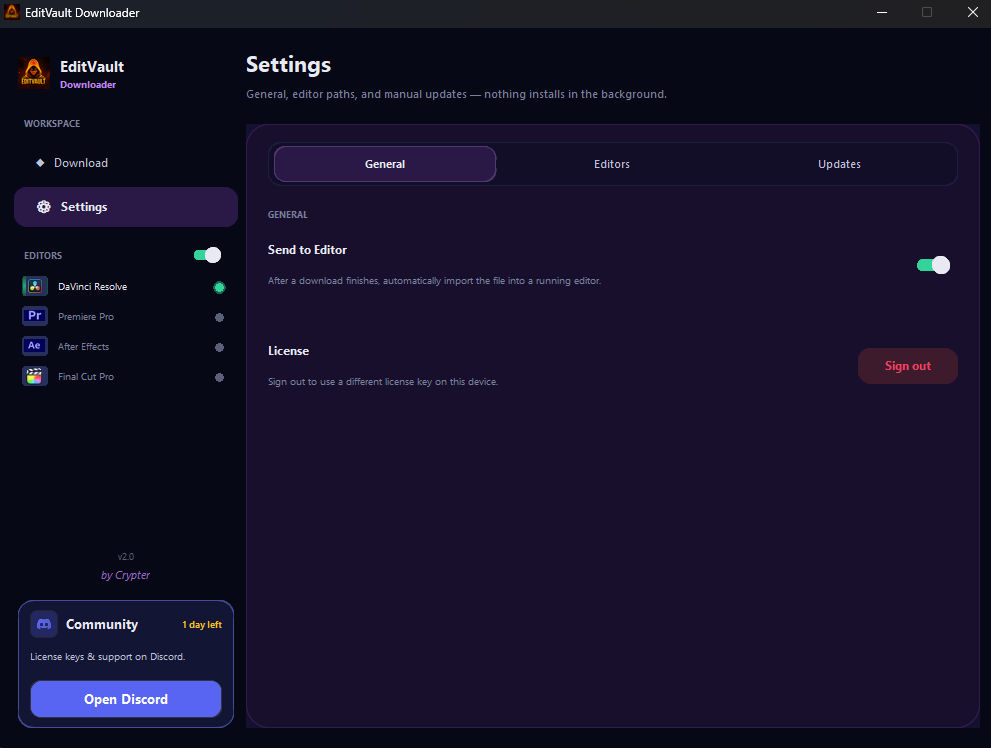

<div align="center">



# EditVault Downloader

**Download clips from YouTube, Instagram, TikTok, and more — built for video editors.**

<table align="center">
<tr>
<td>
<a href="https://mega.nz/file/B2g2QQRC#kgcQFVGG2EYcyFWnDPmIdASF3WhxdUqBKu9Whd0B3iM">

</a>
</td>
<td>

</td>
<td>

</td>
</tr>
</table>

**~39 MB** · extract and run `EditVault.exe`

[Website](https://editvault.net) · [Discord](https://discord.gg/9YYV5hyWKa)

<pre>
┌─────────────────────────────────────────────────────────────┐
│  Paste URL  →  Pick quality  →  Download  →  Send to Editor │
└─────────────────────────────────────────────────────────────┘
</pre>

| | |
|:---:|:---:|
| **Double-click and go** | Run <code>EditVault.exe</code> — no setup required |
| **Up to 8K** where the source allows | 12 supported platforms |
| **Editor handoff** | DaVinci Resolve · Premiere Pro · After Effects |

<br />

<table>
<tr>
<td align="center" width="50%">

<br><sub><strong>Download Studio</strong> — paste a URL, pick platform &amp; quality, download</sub>
</td>
<td align="center" width="50%">

<br><sub><strong>Settings</strong> — Send to Editor, license, and manual updates</sub>
</td>
</tr>
</table>

</div>

---

## Why EditVault?

**EditVault Downloader** is a standalone Windows desktop app for creators who want fast, high-quality downloads and a smooth handoff into their NLE.

- Pick a platform and resolution (up to **8K** where available)
- Download to a dedicated folder under your **Videos** library
- Optional **Send to Editor** after each download
- Sign in once with your license key — stay activated on your machine

> **First launch** can take 20–40 seconds while the single-file app unpacks. Later launches are faster.

---

## Quick start

<table>
<tr>
<td width="48" align="center"><strong>1</strong></td>
<td><strong>Extract</strong> the release folder anywhere (Desktop, Documents, etc.)</td>
</tr>
<tr>
<td align="center"><strong>2</strong></td>
<td>Double-click <code>EditVault.exe</code></td>
</tr>
<tr>
<td align="center"><strong>3</strong></td>
<td>Sign in with your <strong>EditVault license key</strong></td>
</tr>
<tr>
<td align="center"><strong>4</strong></td>
<td>On first launch, the app may download the <strong>EditVault-AI engine</strong> once — wait until status shows <strong>Ready</strong></td>
</tr>
<tr>
<td align="center"><strong>5</strong></td>
<td>Paste a URL, choose resolution, download</td>
</tr>
</table>

---

## System requirements

| Requirement | Details |
|-------------|---------|
| **OS** | Windows 10 or 11 (64-bit) |
| **RAM** | 4 GB+ recommended |
| **Disk** | ~500 MB for app; extra space for downloads and the EditVault-AI engine |
| **Network** | Required for login, downloads, and first-time engine setup |

---

## Platforms · Resolutions · Send to Editor

<table>
<tr>
<th align="left" width="34%">Supported platforms</th>
<th align="left" width="33%">Resolutions</th>
<th align="left" width="33%">Send to Editor</th>
</tr>
<tr>
<td valign="top">

<strong>YouTube</strong> · <strong>Instagram</strong> · <strong>TikTok</strong><br>
<strong>SoundCloud</strong> · <strong>Facebook</strong> · <strong>X (Twitter)</strong><br>
<strong>Pinterest</strong> · <strong>Twitch</strong> · <strong>Vimeo</strong><br>
<strong>Patreon</strong> · <strong>LinkedIn</strong><br>
<br>
<sub>Playlists where supported (YouTube, SoundCloud, Vimeo, Patreon).</sub>

</td>
<td valign="top">

<strong>Best quality</strong> · <strong>4320p (8K)</strong><br>
<strong>2160p (4K)</strong> · <strong>1440p</strong><br>
<strong>1080p</strong> · <strong>720p</strong><br>
<strong>480p</strong> · <strong>360p</strong><br>
<strong>Audio only (mp3)</strong><br>
<br>
<sub>Options depend on the source.</sub>

</td>
<td valign="top">

<strong>DaVinci Resolve</strong> — media pool import<br>
<strong>Adobe Premiere Pro</strong> — reveal / import<br>
<strong>After Effects</strong> — project import<br>
<br>
<sub>Enable in Settings. Keep your NLE open before sending.</sub>

</td>
</tr>
</table>

---

## Where files live on your PC

EditVault keeps **portable** and **writable** data separate. You can move the `.exe` folder; settings and the EditVault-AI engine stay in your user profile.

### App data

| Platform | Folder |
|----------|--------|
| **Windows** | `%APPDATA%\EditVault\` |
| **macOS** | `~/Library/Application Support/EditVault/` |
| **Linux** | `~/.config/EditVault/` |

**Typical Windows path:**

```text
C:\Users\<You>\AppData\Roaming\EditVault\
```

> Uninstalling: delete `EditVault.exe` and, if you want a full reset, remove the `EditVault` folder under AppData above.

### Default download folder

| Platform | Default path |
|----------|----------------|
| **Windows** | `%USERPROFILE%\Videos\EditVault_Downloads` |
| **macOS** | `~/Movies/EditVault_Downloads` (or `~/Videos/EditVault_Downloads` if Movies is unavailable) |
| **Linux** | `~/Videos/EditVault_Downloads` |

You can change the folder anytime in the app with **Browse**.

---

## Updates

- **App updates**: Settings → check for a newer **EditVault** release
- **EditVault-AI engine**: Optional refresh from Settings (manual; does not run in the background)

Your installed version is shown in the app (currently **v2.0.0** for this package).

---

## Troubleshooting

| Issue | What to try |
|-------|-------------|
| Stuck on “Booting engine…” | Wait 1–2 minutes on first run; ensure internet works; check antivirus is not blocking `EditVault.exe` or the EditVault-AI engine folder under `%APPDATA%\EditVault\`. |
| License invalid | Sign in again; confirm key is active on [Discord](https://discord.gg/9YYV5hyWKa). |
| Download fails | Refresh the EditVault-AI engine in Settings; try another URL or lower resolution. |
| Send to Editor does nothing | Open the editor first; confirm only one target editor is running; check activity log in the app. |

**Activity log:** `%APPDATA%\EditVault\download_logs.txt`

---

## Links

| | |
|---|---|
| **Website** | [editvault.net](https://editvault.net) |
| **Discord** | [discord.gg/9YYV5hyWKa](https://discord.gg/9YYV5hyWKa) |

---

## Legal

Use EditVault only for content you have the right to download and edit. EditVault is not affiliated with YouTube, Meta, TikTok, or other platforms. Trademarks belong to their owners.

---

<div align="center">

<sub>© EditVault · Windows desktop package · <code>EditVault.exe</code> + this README</sub>

<br /><br />

**Made for editors who'd rather be cutting than copy-pasting URLs.**

</div>
